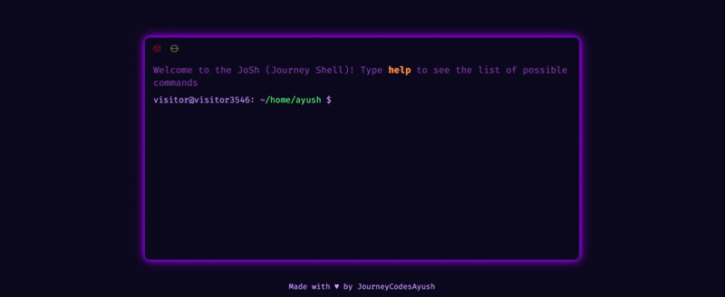

# 🖥️ JoSh (Journey Shell)

<p align="center">
  
</p>


[](https://github.com/JourneyCodesAyush/josh/discussions)

---

A terminal-style portfolio built using HTML, CSS, and vanilla JavaScript.  
Inspired by [evilprince2009.github.io](https://github.com/evilprince2009/evilprince2009.github.io), this project brings the retro charm of a command-line interface to your personal website.

> ⚠️ **Note**: This portfolio currently supports only desktop view (no mobile responsiveness yet).

---

## Live Demo

🎯 **Live Site**: [jo-sh.vercel.app](https://jo-sh.vercel.app/)



## 🚀 Features

- 💻 **Command-line style interface**
- 🧾 Built-in UNIX-like commands (`cd`, `ls`, `man`, `echo`, etc.)
- 📁 Simulated file system navigation
- ✏️ Custom `whoami`, `setname`, and `social` commands
- 🧠 Command history with arrow key recall
- 📚 `man` pages for command help
- 🖱️ Mouse-free, fully keyboard-driven interaction
- 💡 No frameworks, just HTML + CSS + JS

---

## 🛠️ Getting started

### Run Locally

You can simply open `index.html` in your browser — no server required.

Once running, you'll be greeted with a terminal-like interface. Try typing help or man to get started!

---

| File            | Purpose                            |
| --------------- | ---------------------------------- |
| `fileSystem.js` | Add your data here to customize    |
| `manuals.js`    | Customize `man` pages              |
| `style.css`     | Tweak the appearance & colors      |
| `main.js`       | Set welcome message & prompt style |

You can also:

- Add new commands inside `js/commands/` and register them in `registry.js`.
- Modify the virtual file system for your own content.

---

## 🔧 Customizing Your Fork

Feel free to fork this repo and make it your own! Here are some quick tips to get started:

- 📁 **Customize your portfolio content** by editing the `fileSystem.js` file — this is where you add your personal files and structure.

- 🛠️ **Add new commands** by creating JavaScript files inside the `js/commands/` folder, then register them in `registry.js`.

---

## 📁 Project Structure

```bash
josh/
├── favicon.ico        # Website favicon
├── package.json       # Project metadata and dependencies
├── package-lock.json  # Exact dependency versions
├── eslint.config.mjs  # ESLint configuration
├── .stylelintrc.json  # Stylelint configuration
├── index.html         # Main HTML file
├── style.css          # Global styles
├── jsconfig.json      # JS project settings (paths, aliases)
├── js/
│   ├── ui.js          # DOM manipulation & terminal UI logic
│   ├── filesystem.js  # Virtual file system logic
│   ├── manuals.js     # Manual/help content for commands
│   ├── commandHistory.js # Command history stack
│   ├── types.js       # JSDoc type definitions
│   ├── main.js        # Entry point: initializes terminal
│   ├── utils.js       # Helper functions
│   └── commands/      # All terminal commands
│       ├── cat.js
│       ├── cd.js
│       ├── clear.js
│       ├── date.js
│       ├── echo.js
│       ├── help.js
│       ├── history.js
│       ├── ls.js
│       ├── man.js
│       ├── pwd.js
│       ├── setname.js
│       ├── whoami.js
│       ├── social.js
│       ├── registry.js # Command registration
│       └── index.js    # Central export for commands
├── LICENSE             # License information
└── README.md           # You're reading it!
```

---

## 🧑‍💻 Development Guide

- Keep command logic modular (`one file = one command`)
- Use `registry.js` to register all commands
- Follow the Unix philosophy: do one thing, do it well

---

## 🧾 Commit Message Convention

✍️ The project follows **[Conventional Commits](https://www.conventionalcommits.org/en/v1.0.0/)**, so when contributing or maintaining your fork, use commit messages like:

Please use this format when writing commit messages:

`<type>(<scope>): <short message>`

| Type       | Description                                           |
| ---------- | ----------------------------------------------------- |
| `feat`     | A new feature                                         |
| `fix`      | A bug fix                                             |
| `docs`     | Changes to documentation only                         |
| `style`    | Code formatting changes (no logic impact)             |
| `refactor` | Code improvements that don't fix bugs or add features |
| `test`     | Adding or modifying tests                             |
| `chore`    | Routine tasks, build scripts, config changes          |

### 📌 Examples

```bash
feat(weather): add weather command
fix(ui): fix prompt rendering bug
docs(readme): update README with new instructions
```

If you have questions or want to share your work, feel free to open issues or PRs!

---

## 🧪 Linting

Ensure consistent code style with:

```bash
npm run lint
```

---

## 📄 License

This project is licensed under the **MIT License**.

```text
MIT License

Permission is hereby granted, free of charge, to any person obtaining a copy
of this software and associated documentation files (the “Software”), to deal
in the Software without restriction, including without limitation the rights
to use, copy, modify, merge, publish, distribute, sublicense, and/or sell copies
of the Software, and to permit persons to whom the Software is furnished to do so,
subject to the following conditions:

THE SOFTWARE IS PROVIDED “AS IS”, WITHOUT WARRANTY OF ANY KIND, EXPRESS OR IMPLIED.
```

---

## 🤝 Contributing

Pull requests are welcome! Feel free to fork the project and submit improvements.

Before contributing, please ensure:

- Your code is clean and linted
- Commands are registered in the `registry.js`
- Your code follows the style of existing commands

---

## 🙏 Acknowledgements

- Inspired by [this amazing guy](https://github.com/evilprince2009/evilprince2009.github.io/)
- Built with &hearts; using plain HTML, CSS & JavaScript
- Thanks to [shields.io](https://shields.io/) for the awesome badges

---

## 📬 Author

Made with ❤️ by [JourneyCodesAyush](https://github.com/JourneyCodesAyush/)

---

## 📛 Why "JoSh"?

The name **JoSh** stands for **Journey Shell** — a personal take on a UNIX-like terminal interface.  
It's inspired by my GitHub handle: [`JourneyCodesAyush`](https://github.com/JourneyCodesAyush), and reflects my journey as a developer learning and building with modern web technologies.

---

## ☁️ Special Thanks to Vercel

[](https://vercel.com)

Big thanks to [**Vercel**](https://vercel.com) for providing a fast, reliable, and **free hosting platform** for this project.  
Their platform made deploying and sharing this terminal-style portfolio incredibly simple.

You can view the live site hosted on Vercel [here](https://jo-sh.vercel.app/).
